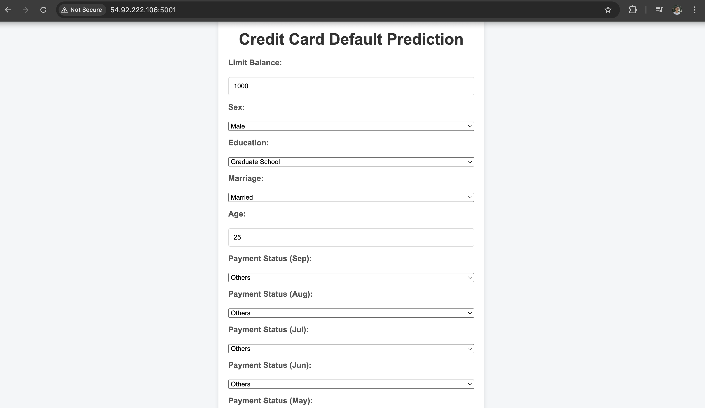
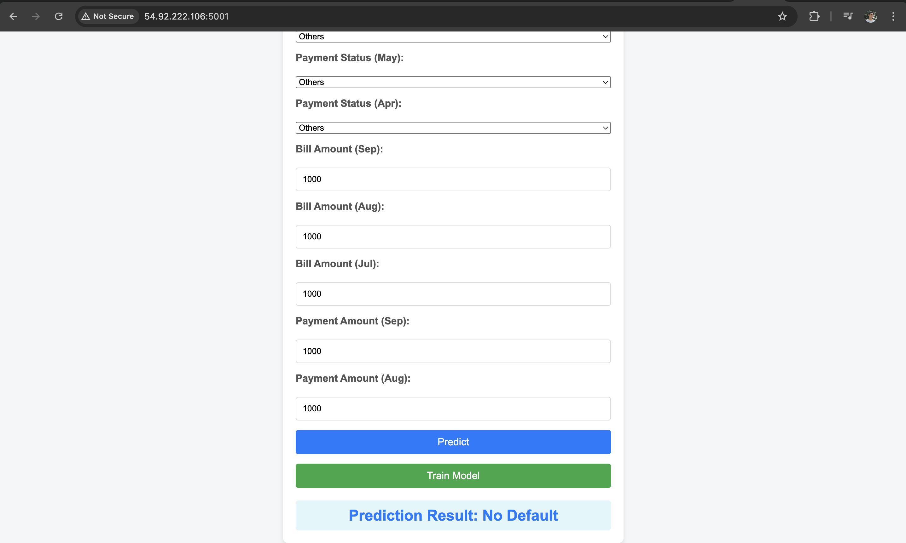

# 🚀 Credit Card Fraud Detection — End-to-End MLOps Pipeline

This project is an end-to-end implementation of a **Credit Card Fraud Detection System** with a full MLOps lifecycle: from data ingestion to model deployment using cloud infrastructure, Docker, CI/CD pipelines, and monitoring. It follows modular, scalable, and reproducible architecture principles.

---

## 📌 Project Highlights

- **Modular Architecture** using Python packages
- **MongoDB Atlas** as cloud database for data storage
- **EDA & Feature Engineering** notebooks
- **Pipeline Components**:
  - Data Ingestion
  - Data Validation
  - Data Transformation
  - Model Training
  - Model Evaluation
  - Model Pusher
- **AWS Integration** with S3, EC2, ECR
- **Dockerized** ML App
- **CI/CD Pipeline** via GitHub Actions + Self-hosted EC2 runner
- **Web App Deployment** using Flask
- **Accessible via EC2 Public IP on Port 5080**

---

## 🛠️ Tools & Technologies Used

| Category            | Tools/Tech Stack                                  |
|---------------------|---------------------------------------------------|
| Language            | Python 3.12                                        |
| Data Storage        | MongoDB Atlas                                     |
| Data Handling       | pandas, numpy, PyYAML                             |
| ML/DL               | scikit-learn                                      |
| Logging             | Python Logging module                             |
| Deployment          | FastAPI, Docker, AWS EC2, AWS S3, AWS ECR           |
| CI/CD               | GitHub Actions (Self-Hosted Runner on EC2)        |
| Package Mgmt        | pip, conda, setup.py, pyproject.toml              |

---

## 📂 Project Structure

```bash
.
├── app.py                       # Flask app entry point
├── Dockerfile
├── .github/workflows/aws.yaml  # CI/CD workflow
├── notebook/                   # Notebooks + mongoDB demo
├── src/
│   ├── components/             # Pipeline logic (ingestion, validation, etc.)
│   ├── configuration/          # DB & AWS connections
│   ├── data_access/            # MongoDB access layer
│   ├── entity/                 # Config & Artifact entities
│   ├── exception/              # Custom exceptions
│   ├── logger/                 # Logging setup
│   ├── aws_storage/            # S3 push/pull logic
├── templates/                  # HTML templates for web app
├── static/                     # Static assets for frontend
├── setup.py
├── pyproject.toml
├── requirements.txt
├── crashcourse.txt
└── README.md
````

---

## ⚙️ Setup Instructions

### 🔧 1. Project Initialization

```bash
python template.py
```

### 📦 2. Package Setup

* Add local packages via `setup.py` and `pyproject.toml`.
* Refer to `crashcourse.txt` for details.

### 🐍 3. Virtual Environment

```bash
conda create -n creditcard python=3.12 -y
conda activate creditcard
pip install -r requirements.txt
pip list  # Check if packages are installed
```

---

## ☁️ MongoDB Atlas Setup

1. Sign up at [MongoDB Atlas](https://www.mongodb.com/cloud/atlas).
2. Create a project & cluster (M0 free tier).
3. Set DB user and IP access to `0.0.0.0/0`.
4. Copy the connection string and replace `<password>`.
5. Push dataset to MongoDB using `mongoDB_demo.ipynb`.

---

## 🧪 EDA, Logging & Exceptions

* EDA and Feature Engineering notebook is provided.
* Logging system setup via `logger/` and tested with `demo.py`.
* Custom exception handling via `exception/` directory.

---

## 🏗️ Pipeline Components

### ✅ 1. Data Ingestion

* MongoDB to pandas dataframe conversion.
* Defined in `data_access`, `components`, and `entity` modules.

### 🔍 2. Data Validation

* Schema config: `config/schema.yaml`
* Validates data consistency before training.

### 🔄 3. Data Transformation

* Feature transformations + train-test split
* Defined in `components.data_transformation`

### 🎯 4. Model Trainer

* Model training and metric evaluation
* Add model definition to `entity.estimator.py`

---

## ☁️ AWS Setup

1. Setup IAM user with `AdministratorAccess`
2. Create `.csv` file for access keys.
3. Set environment variables:

```bash
export AWS_ACCESS_KEY_ID="..."
export AWS_SECRET_ACCESS_KEY="..."
```

4. Create S3 Bucket `my-model-mlopsproj`
5. Add push/pull logic to `src/aws_storage/` and `entity/s3_estimator.py`

---

## 📊 Model Evaluation & Deployment

* Model Evaluation component checks performance drift.
* Push best model to S3 via Model Pusher.

---

## 🌐 Flask Web App

* Access `/training` to trigger model training.
* Deployed via EC2 public IP + port `5080`.

---



## 🐳 Docker Setup

```bash
# Dockerfile + .dockerignore setup
docker build -t creditproj .
```

---

## 🔁 CI/CD with GitHub Actions

1. Setup self-hosted runner on EC2 (Ubuntu)
2. Connect runner via GitHub Settings > Actions > Runners
3. Add GitHub Secrets:

   * `AWS_ACCESS_KEY_ID`
   * `AWS_SECRET_ACCESS_KEY`
   * `AWS_DEFAULT_REGION`
   * `ECR_REPO`

---

## 🌍 Deploy to EC2

1. Create EC2 Ubuntu instance.
2. Install Docker:

```bash
curl -fsSL https://get.docker.com -o get-docker.sh
sudo sh get-docker.sh
```

3. Enable custom port:

   * Go to Security > Inbound Rules > Add TCP Rule: 5080
4. Access app:

   ```
   http://<your-public-ip>:5080
   ```

---

## ✅ Status

| Component           | Status |
| ------------------- | ------ |
| Project Template    | ✅      |
| MongoDB Setup       | ✅      |
| Data Ingestion      | ✅      |
| Data Validation     | ✅      |
| Data Transformation | ✅      |
| Model Training      | ✅      |
| Model Evaluation    | ✅      |
| AWS Integration     | ✅      |
| CI/CD Pipeline      | ✅      |
| EC2 + FastAPI App     | ✅      |

---

## 🙌 Contributing

Pull requests are welcome! For major changes, please open an issue first to discuss what you would like to change.

---

## 📃 License

This project is licensed under the MIT License.

---

## 📧 Contact

For questions or support, contact [your\_email@example.com](mailto:abhishekmayya@gmail.com)

---

⭐️ If you like this project, give it a star and share it with your peers!

```
